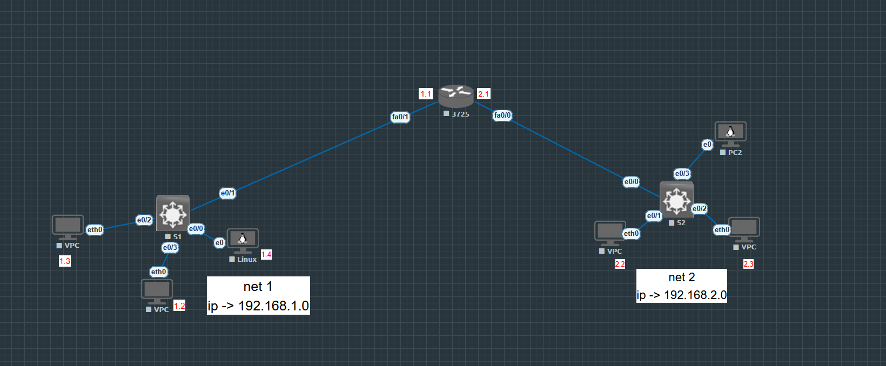

# Lab: lab-01-ip-addressing

## 📋 Informations générales
- **Compétence**: Addressage IP
- **Date de création**: 20/02/2026
- **Description**: 

## 📐 Topologie

### Équipements
| Type | Nombre | Modèle | Version |
|------|--------|--------|---------|
| Routeur | 1 | Cisco 3725 | 12.4(15)T14 |
| Switch | 2 | Cisco I86BI_LINUXL2-ADVENTERPRISEK9-M | 15.2 |
| Desktop Linux | 2 | Linux Debian & Kali |  |
| VPC | 4 | Virtual PC Simulator |  1.3 (0.8.1) |

## 🔧 Configuration IP

### Routeurs
| Device | Interface            | IP/Mask        | Description               |
|--------|----------------------|----------------|---------------------------|
| 3725   |fa0/1 -> 192.168.1.1  |  255.255.255.0 | interface du réseau net 2 |
|        |fa0.0 -> 192.168.2.1  |  255.255.255.0 | interface du réseau net 1 |

### Switches
| Device | VLAN | Interface | Mode |
|--------|------|-----------|------|

## 📁 Fichiers inclus
- `lab-01-ip-addressing.unl` : Topologie Eve-ng
- `configs/` : Configurations exportées
- `diagrams/` : Diagrammes réseau

## 🚀 Déploiement
1. Copier `lab-01-ip-addressing.unl` dans `/opt/unetlab/labs/`
2. Importer dans Eve-ng
3. Démarrer les nœuds

## 📝 Notes
- Note 1
- Note 2

---
*Document généré automatiquement le ven. 20 févr. 2026 10:17:15 UTC*
