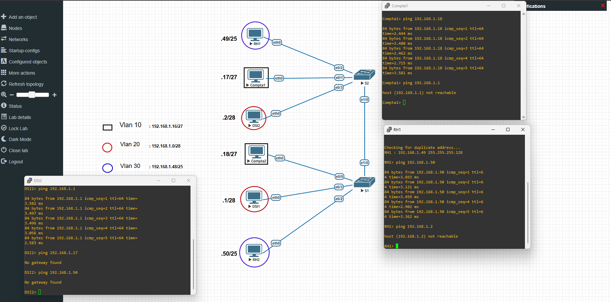

# Lab: lab-02-vlan-acl

## 📋 Informations générales
- **Compétence**: VLAN, ACL
- **Date de création**: 14/05/2026
- **Description**: Lab sur les VLAN et les ACL.

## 📐 Topologie

### Équipements
| Type          | Nombre | Modèle                                | Version     |
|---------------|--------|---------------------------------------|-------------|
| Routeur       | 0      | Cisco 3725                            | 12.4(15)T14 |
| Switch        | 2      | Cisco I86BI_LINUXL2-ADVENTERPRISEK9-M | 15.2        |
| Desktop Linux |        | Linux Debian & Kali                   |             |
| VPC           | 6      | Virtual PC Simulator                  | 1.3 (0.8.1) |

## 🔧 Configuration IP

### Routeurs
| Device | Interface | IP/Mask | Description |
|--------|-----------|---------|-------------|

### Switches
| Device | VLAN      | Interface | Mode |
|--------|-----------|-----------|------|
|S1      |10,20,30   |e0/0,e0/2-3|access|
|S1      |99 (Native)|e1/0       |trunk |
|                                       |
|S2      |10,20,30   |e0/1-3     |access|
|S2      |99 (Native)|e1/0       |trunk |

## 📁 Fichiers inclus
- `lab-02-vlan-acl.unl` : Topologie Eve-ng
- `configs/` : Configurations exportées
- `diagrams/` : Diagrammes réseau

## 🚀 Déploiement
1. Copier `lab-02-vlan-acl.unl` dans `/opt/unetlab/labs/`
2. Importer dans Eve-ng
3. Démarrer les nœuds

## 📝 Notes
- Certains modèles de switch cisco nécessite l'activation de l'encapsulation dot1q pour assurer le trunk de leurs interfaces. Pour se faire, la commande suivante est utilisée : "switchport trunk encapsulation dot1q".

---
*Document généré automatiquement le jeu. 14 mai 2026 17:28:12 UTC*
